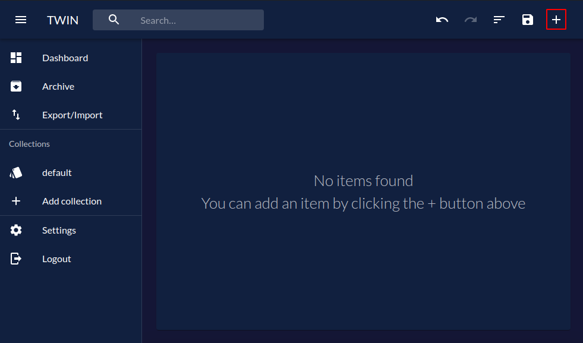
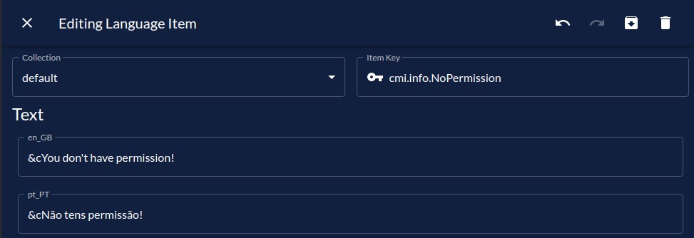

# First Translation

## Video Tutorial

If you prefer a video tutorial of this guide, you can follow the official get started video:

<div class="video-wrapper">
<iframe width="853" height="480" src="https://www.youtube.com/embed/ZJQUd1oD1EY" frameborder="0" allow="accelerometer; autoplay; encrypted-media; gyroscope; picture-in-picture" allowfullscreen></iframe>
</div>

## Ways of Translating

Before proceeding, it is important to note that there are 5 ways to translate messages using Triton.
This guide will only talk about the first two:
  - Triton Placeholders
  - Triton Advanced Placeholders
  - Triton Patterns
  - PlaceholderAPI
  - [Triton API](/programatic-api/getting-started)

### Triton Placeholders

As an example, we're going to translate the [CMI plugin](https://www.spigotmc.org/resources/cmi-270-commands-insane-kits-portals-essentials-economy-mysql-sqlite-much-more.3742/),
more precisely the `info.NoPermission` message:

```yaml{3}
info:
  prefix: '&e[&aCMI&e] '
  NoPermission: '&cYou don''t have permission!'
  CantHavePermission: '&cYou can''t have this permission!'
  NoPlayerPermission: '&c[playerName] doesn''t have permission for: [permission]'
  Ingame: '&cYou can only use this in game!'
  NoInformation: '&cNo information found!'
...
```

As we can see, the `info.NoPermission` message is pretty simple to translate because it doesn't have any kind of variables.

#### Step 1 - Add the translation to Triton

:::: tabs

::: tab TWIN
Before proceeding, make sure you've [setup TWIN](/getting-started/initial-configuration#translations).

If you haven't already, open TWIN by running `/twin` on console or in-game.

Proceed to create a new translation item. When prompted, select _Text_ as the type.



Then, fill in the information as needed:
  - **Key**: `cmi.info.NoPermission`
  - **en_GB**: `&cYou don't have permission!`
  - Translate accordingly to other languages.



After that's done, click the `X` button on the top left corner (or hit `ESC` on your keyboard) to go back to the dashboard.
You can repeat this proccess for other translations.

When you're ready, hit `Save` in the top right corner of the dashboard.
Follow the on-screen instructions to download the translations to the server.
:::

::: tab JSON
When using JSON, the process gets a little more complicated.

1. First, go into the `translations` folder inside the `plugins/Triton` folder. If it doesn't exist, create one.
2. Then, either create a new file (e.g. `cmi.json`) or use `default.json`.

These files (called collections), contain a [JSON array](https://www.javatpoint.com/json-array) with all the translations.
Here is an example file with just this translation:

```json
[
  {
    "type": "text",
    "key": "cmi.info.NoPermission",
    "languages": {
      "en_GB": "&cYou don't have permission!",
      // Translate accordingly
      "pt_PT": "&cNão tens permissão!"
    }
  }
]
```

Finally, save the file and reload the plugin with `/triton reload`.
:::

::::

::: tip
You don't have to use the `cmi.info.NoPermission` key. It was just the example.
As long as you use the same key in the placeholder, it can be whatever you want.  
However, I'd personally recommend following some kind of convention for your keys.
:::

#### Step 2 - Replace the original message with the placeholder

After adding the translation to Triton, you must replace the original message with a Triton placeholder.
Triton placeholders follow the following syntax: `[lang]insert.translation.key.here[/lang]`.

With that in mind, you can simply replace the original message with the placeholder.

```yaml{3}
info:
  prefix: '&e[&aCMI&e] '
  NoPermission: '[lang]cmi.info.NoPermission[/lang]'
  CantHavePermission: '&cYou can''t have this permission!'
  NoPlayerPermission: '&c[playerName] doesn''t have permission for: [permission]'
  Ingame: '&cYou can only use this in game!'
  NoInformation: '&cNo information found!'
...
```

### Triton Advanced Placeholders

We've already seen how to translate a message without variables,
but what about a message **with** variables?  
Well, that's exactly what we're going to do now.

This is where we left off in the previous section:

```yaml{5}
info:
  prefix: '&e[&aCMI&e] '
  NoPermission: '[lang]cmi.info.NoPermission[/lang]'
  CantHavePermission: '&cYou can''t have this permission!'
  NoPlayerPermission: '&c[playerName] doesn''t have permission for: [permission]'
  Ingame: '&cYou can only use this in game!'
  NoInformation: '&cNo information found!'
...
```

We're now going to translate the `info.NoPlayerPermission` message.

#### Step 1 - Add the translation to Triton

For more information on adding translations to Triton using TWIN or JSON,
take a look at the previous section.

The only difference between this section and the previous one
is the content of the translation.  
Triton works by replacing `%1`, `%2`, `%3`, etc by the given variables.
As such, we're going to replace the variables in the original message
`&c[playerName] doesn''t have permission for: [permission]` with `%1` and `%2`.  
The result should be something like `&c%1 doesn''t have permission for: %2`.

::: tip
Now matter how the plugin you're translating handles variables,
you'll always need to replace them with `%1`, `%2`, `%3`, etc...  
The original variables will be used in *Step 2*.
:::

#### Step 2 - Replace the original message with the placeholder

This step is also very similar with the one from the previous section.  
When using variables, the format differs slightly:
```[lang]insert.translation.key.here[args][arg]variable1[/arg][arg]variable2[/arg][/args][/lang]```.

Keep in mind that everything inside the `[arg][/arg]` tags will be used as a replacement
to `%1`, `%2`, etc in the final message, following the order in which they were added.

This is how we'll use it for our use-case:

```yaml{5}
info:
  prefix: '&e[&aCMI&e] '
  NoPermission: '[lang]cmi.info.NoPermission[/lang]'
  CantHavePermission: '&cYou can''t have this permission!'
  NoPlayerPermission: '[lang]cmi.info.NoPlayerPermission[args][arg][playerName][/arg][arg][permission][/arg][/args][/lang]'
  Ingame: '&cYou can only use this in game!'
  NoInformation: '&cNo information found!'
...
```

## Using the automated generator tool

An [open-source tool](https://triton-generator.rexcantor64.com/) is in the works
that'll mostly automate these steps.
A guide on how to use it will be available later.

Already generated translations for some plugins is available in the 
[triton-translation-collection](https://github.com/tritonmc/triton-translation-collection)
GitHub repository.
